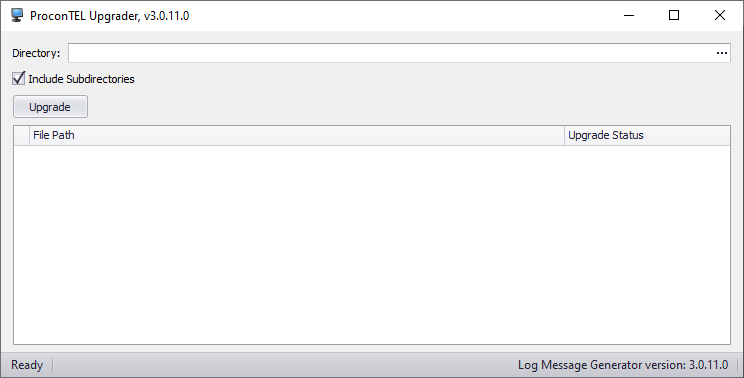

# Simple usage of ProconTEL Updater

## Steps to fully update project

- Standard updating using ProconTEL Updater

```
The same like it was before. Search for directory and click upgrade.
```




- Update ProconTEL.Sdk

```
Use nuget manager updater to upgrade your version 
```


