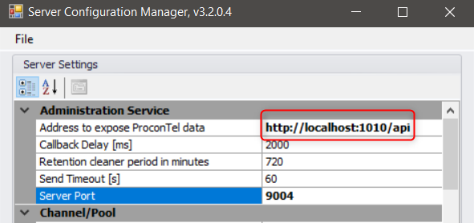

Before starting make sure you set up the connection address. By default, the address is not set. To set the connection address run the tool "ServerConfigurationManager".



The endpoint declaration:
```csharp
    [EndpointMetadata(Name = "[Test] Api.Client.Legacy", SupportedRoles = SupportedRoles.Both)]
  public class Endpoint : IEndpointLifeTimeCycle
  {
    ...
  }
```


The usage of Api.Client.Legacy:

```csharp
   private void LogChannelsAndPoolsNames()
    {
      var names = GetNamesOfAllChannelsAndPools("http://localhost:1010/api");

      ...
    }
```

```csharp
  private string[] GetNamesOfAllChannelsAndPools(string address)
    {
      var connection = new Connection(address);

      if (!connection.Open())
        return Array.Empty<string>(); 

      try
      {
        var channelsAndPools = new List<string>();
        
        var channels = connection.Manager.GetChannels();
        channelsAndPools.AddRange(channels.Select(c => c.Name));
        
        var pools = connection.Manager.GetEndpointPools();
        channelsAndPools.AddRange(pools.Select(c => c.Name));

        return channelsAndPools.ToArray();
      }
      finally
      {
        connection.Close();
      }
    }
```

