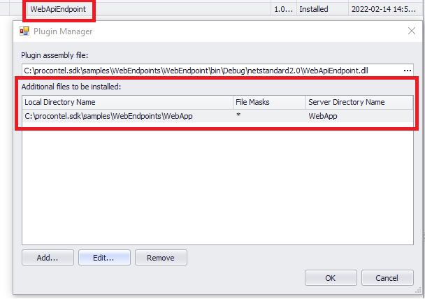
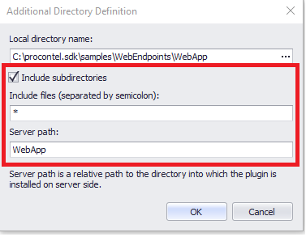
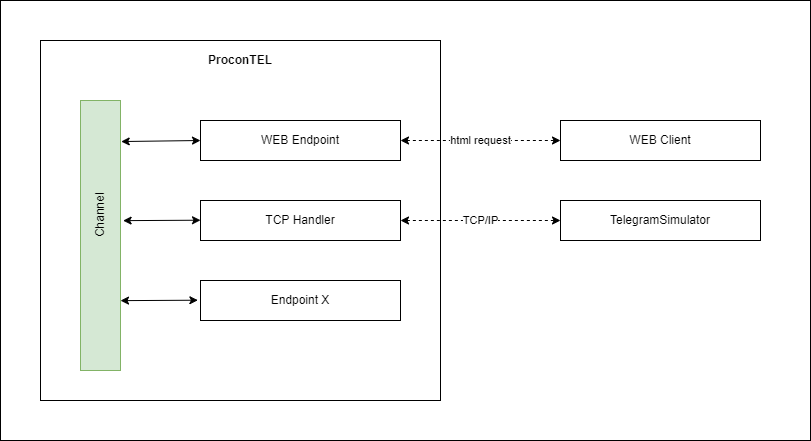

## Table of Contents

1. [Quick introduction](#quick-introduction)
2. [Web endpoint settings](#endpoint-settings)
3. [Dependency injection](#dependency-injection)
4. [Hosting static files](#hosting-static-files)
5. [Accessing ProconTEL communication from ASP.NET Core Controller](#broadcasting-messages)
 
 <div id='quick-introduction'/>

## 1. Quick introduction

Using ProconTEL it is possible to create an application that will expose REST API using HTTP/HTTPS protocol and additionally host static web application (like _Angular_ or _React_ single page application). This instruction describes example based on _Microsoft ASP.NET_ for setting REST API and simple static content files serving as web application.

Due to ProconTEL version currently based on _.NET Framework 4.7.2_, thid example is based on _Microsoft ASP.NET Core_ version **2.2**. This is currently the highest supported version.

<div id='endpoint-settings'/>

## 2. Web endpoint settings

The `WebEndpoint` is responsible for configuring and starting the web service. For this purpose, endpoint implements `IEndpointLifeTimeCycle` interface which defines the `InitializeAsync` method. The `InitializeAsync` method is executing while the endpoint is activated. The consequently method will configure and lunch the web service.

The endpoint declaration:
```csharp
    public class WebHostEndpoint : IEndpointLifeTimeCycle
```
The web service configuration:
```csharp
    public Task InitializeAsync(IMiddlewareBuilder builder)
    {
      var urls = Urls ?? _defaultUrls;
      _logger.Information($"Start initialize web host, urls = { string.Join(", ", urls.ToArray()) } ");
      Host = Microsoft.AspNetCore.WebHost
        .CreateDefaultBuilder()
        .UseContentRoot(Path.GetDirectoryName(typeof(WebEndpoint).Assembly.Location))
        .ConfigureServices(ConfigureServices)
        .UseStartup<Startup>()
        .UseUrls(urls)
        .Build();
      
      return Host.StartAsync();
    }

    protected virtual void ConfigureServices(IServiceCollection ioc)
    {
      ioc.AddTransient(ctx => _logger);
      ioc.AddTransient(ctx => _runtimeContext);
      ioc.AddTransient(ctx => _messageBus);
    }
```

<div id='dependency-injection'/>

## 3. Dependency injection

_Microsoft ASP.NET_ is using it's own dependency injection container, which can be easily extended with basic ProconTEL services. Later those services can be injected into controllers.

Below example shows how to register ProconTEL `IMessageBus` and `ILogger` into _ASP.NET_ DI container.

Configuration of dependency injection:
```csharp
    protected virtual void ConfigureServices(IServiceCollection ioc)
    {
      ioc.AddTransient(ctx => _logger);
      ioc.AddTransient(ctx => _runtimeContext);
      ioc.AddTransient(ctx => _messageBus);
    }
```
Configuration of MVC controller:
```csharp
  [ApiController]
  [Route("api/[controller]")]
  public class ChannelController : ControllerBase
  {
    private IMessageBus MessageBus { get; }

    public ChannelController(IMessageBus messageBus)
    {
      MessageBus = messageBus;
    }
    ...
  }
```

<div id='hosting-static-files'/>

## 4. Hosting static files

It is possible to use the ProconTEL plugin to host static websites. For this purpose, the service `AddSpaStaticFiles` has been defined in the `Startup` class. Static files of web application need to be added with ProconTEL plugin installation step. Example below shows how to configure ProconTEL endpoint to server static files.

- In the `Startup` class, set the name of the folder where the files will be located. In the example below, this is a folder named `WebApp`. 
```csharp
services.AddSpaStaticFiles(options => { options.RootPath = "WebApp"; });
```

- Install the plugin containing WEB endpoint.
- During plugin installation, select the folder with static files.





- Then add an endpoint to the channel or pool and run it. 

<div id='broadcasting-messages'/>

## 5. Accessing ProconTEL communication from ASP.NET Core Controller

The web endpoint may allow you to communicate with other ProconTEL endpoints. An example of communication with other ProconTEL endpoints is presented below:

